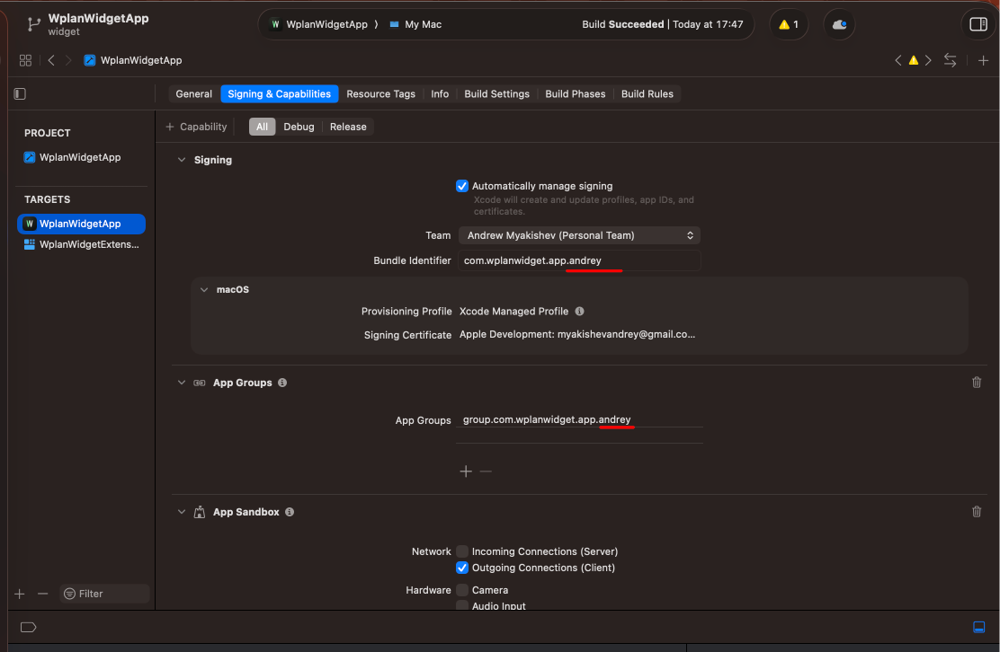
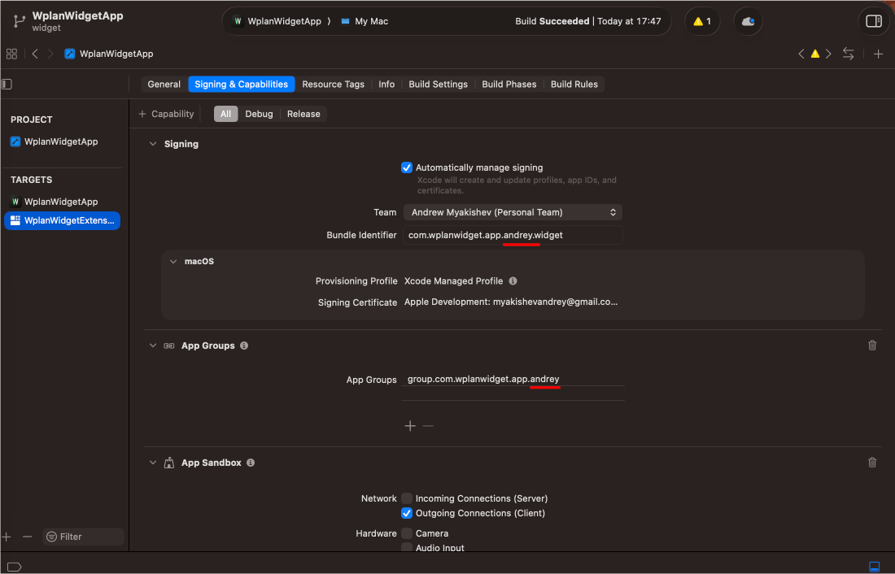

# Wplan Widget

Нативный macOS-агент для Wplan (корпоративной системы учёта рабочего
времени) — иконка в меню-баре + виджет рабочего стола, которые сами
нажимают «начать/закончить день» по расписанию, как только видят
корпоративный VPN.

## Что делает

- **Автоклик по расписанию** — задаёшь время начала/окончания дня (или
  включаешь «8 часов от начала») и дни недели; агент сам отправляет нужный
  запрос в Wplan, как только приходит время и VPN подключён.
- **Меню-бар попап** — текущий статус (VPN / день идёт / день завершён),
  ручные кнопки «Начать»/«Завершить», вход по логину (без `@office.lan` —
  подставляется само) и паролю, хранящемуся в Keychain.
- **Виджет рабочего стола** (компактный и широкий) — кольцо прогресса дня,
  статус VPN, оставшееся время. Отдельные состояния для «день завершён» (с
  кнопкой сброса прямо в виджете), «выходной» (по расписанию, без похода в
  сеть) и «нет данных».
- **Автозапуск при входе в систему.**

## Структура репозитория

- **`WplanCore/`** — Swift-пакет с логикой: GraphQL-клиент Wplan,
  Keychain-хранилище учётных данных, детектор VPN, планировщик автокликов
  (`AutoclickScheduler`/`WplanAutomationAgent`), общий формат снапшота для
  виджета. Покрыт тестами (`swift test`).
- **`WplanWidgetApp/`** — сам macOS-проект (Xcode, генерируется через
  [XcodeGen](https://github.com/yonaskolb/XcodeGen) из `project.yml`):
  меню-бар приложение + WidgetKit-расширение.
- **`scripts/build_dmg.sh`** — упаковка собранного `.app` в drag-to-Applications DMG.
- **`.github/workflows/wplan-widget-release.yml`** — ручной релизный пайплайн (см. ниже).

## Сборка локально

```bash
cd WplanWidgetApp
xcodegen generate
open WplanWidgetApp.xcodeproj
```
Дальше как с обычным Xcode-проектом — Run для отладки, Product → Archive
для релизного билда. Подробности сборки и упаковки — в [DEPLOY.md](DEPLOY.md).

Тесты пакета с логикой:
```bash
cd WplanCore
swift test
```

## Если хочешь собрать свою копию (свой Apple ID)

Bundle ID и App Group в проекте (`com.wplanwidget.app`,
`group.com.wplanwidget.app`) уже зарегистрированы под одним конкретным Apple
ID — Apple требует их глобальной уникальности **на все аккаунты сразу**,
даже для бесплатных Personal Team. Значит, если просто открыть проект в
своём Xcode и выбрать свою команду, будет ошибка вида:

> Failed Registering Bundle Identifier — The app identifier
> "com.wplanwidget.app" cannot be registered to your development team
> because it is not available.

Чтобы собрать свою независимую копию — поменяй идентификаторы на
уникальные (например, добавь своё имя) в трёх местах, прямо в Xcode
(**Signing & Capabilities**):

1. **Team** — выбери свою (нужен залогиненный в Xcode свой Apple ID:
   Xcode → Settings → Accounts).
2. **Bundle Identifier** таргета `WplanWidgetApp` — например
   `com.wplanwidget.app.<твоё-имя>`.
3. **Bundle Identifier** таргета `WplanWidgetExtension` (виджет) — в тон
   первому, например `com.wplanwidget.app.<твоё-имя>.widget`.
4. **App Groups** (у **обоих** таргетов) — убери `group.com.wplanwidget.app`
   и добавь новую, но **одинаковую** у обоих таргетов, например
   `group.com.wplanwidget.app.<твоё-имя>`. Без этого меню-бар приложение и
   виджет перестанут видеть общие данные друг друга.

Как это выглядит в Xcode — таргет `WplanWidgetApp` (Team, Bundle Identifier,
App Groups):



И таргет `WplanWidgetExtension` (тот же Team, свой Bundle Identifier,
**тот же** App Group):



После этого — **Try Again** на ошибке регистрации, дальше обычный Run.
Эти изменения только для твоей локальной сборки, на оригинальный проект и
чужие установки они не влияют.

## Ограничение без платного Apple Developer Program

Сборки подписаны бесплатным сертификатом «Apple Development» — без
нотаризации. Это значит, что на **другом** Mac запуск будет заблокирован
Gatekeeper при первом открытии; обход и все детали — в [DEPLOY.md](DEPLOY.md#что-получит-скачавший-dmg).

## Релизы

Собираются и публикуются на GitHub через workflow `Release`
(`.github/workflows/wplan-widget-release.yml`, запуск вручную из вкладки Actions) —
готовый DMG прикладывается к тегу. Подробная инструкция по разовой
настройке и по каждому релизу — в [DEPLOY.md](DEPLOY.md), список изменений
по версиям — в [CHANGELOG.md](CHANGELOG.md).

## Лицензия

[MIT](LICENSE).
